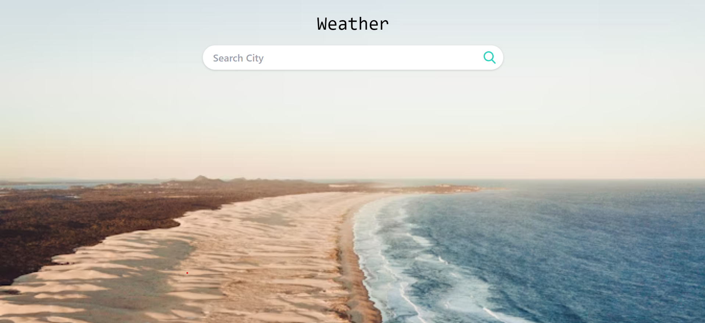
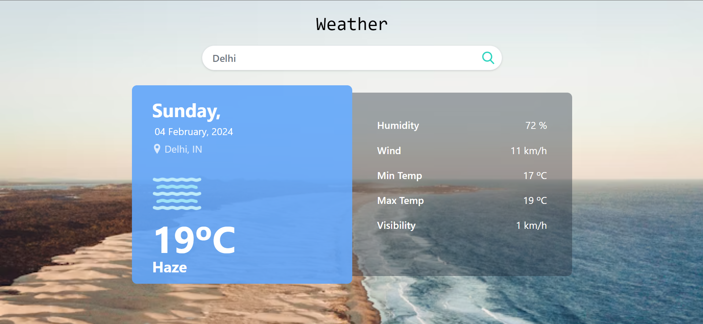
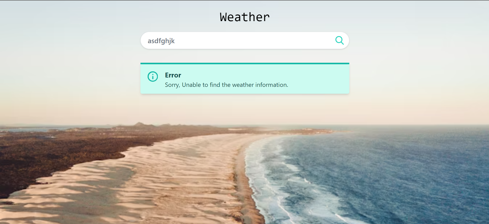

# Django Weather App

## Overview
This Django Weather App provides weather information for a given location using data from an external weather API. Users can input the desired city, and the app will fetch and display current weather details.

## Features
- **Weather Data:** Display real-time weather information including temperature, description, wind speed, etc.
- **User-friendly Interface:** Simple and intuitive interface for users to input and view weather data.
- **External API Integration:** Utilizes an external weather API to fetch accurate and up-to-date weather information.

# Screenshots-

## Home

## Detail

## Error

